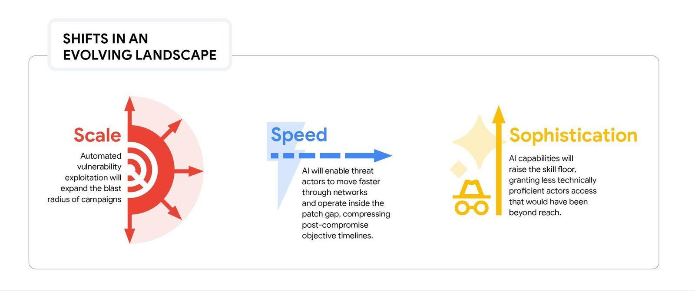

Our team at Google Threat Intelligence Group and Mandiant just published new research on how AI models are accelerating vulnerability discovery and exploitation.

General-purpose AI is increasingly capable of identifying flaws and generating functional exploits, and that capability lowers the barrier significantly for threat actors. The historical gap between public vulnerability disclosure and mass exploitation has always been a window defenders could use to patch and respond. That window is shrinking.

Organizations are no longer defending against purely human-speed exploitation.

The research outlines a few concrete areas where defenders need to modernize:

- **Integrate AI into your SOC.** Specialized AI agents can automate alert triage and generate response playbooks in real time, helping analysts keep pace with an exponential increase in security workload that legacy processes were never designed to handle.
- **Close your asset visibility gaps.** Continuous asset discovery reduces blind spots across cloud environments and edge devices. You cannot defend what you cannot see, and attackers are counting on that.
- **Treat your build pipeline like a network asset.** Source code repositories, CI/CD systems, and build infrastructure are high-value targets. Apply the same access controls, monitoring, and hardening you'd apply to your most critical network segments.

The full research is on the Google Cloud Blog. If you want to go deeper, I'm also presenting on this at the ISC2 Security Briefings webinar on April 16.

[Read the full research](https://cloud.google.com/blog/topics/threat-intelligence/defending-enterprise-ai-vulnerabilities)
