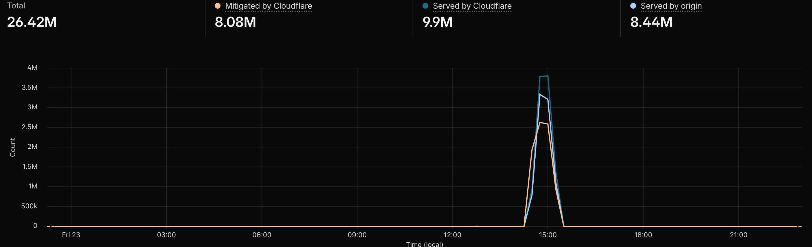

I rebuilt my personal site. The old one served me well. A single Carrd.co page that survived more than a few DDoS attempts. But it was time for something more modern and feature rich, and more importantly, automated to avoid having to update the site myself.

This site is built with [Astro](https://astro.build) and deploys automatically via [Cloudflare Pages](https://pages.cloudflare.com) every time I push to GitHub. Everything is static at the edge, which means it loads fast and costs nothing to run. After years of dealing with DDoS attacks against my old site, having Cloudflare's infrastructure baked in from the start felt like the right call.

The media section pulls in press coverage and quotes automatically. Upcoming talks and past conference appearances are kept up to date in the same way. When I post on LinkedIn, those get surfaced here too so everything lives in one place rather than scattered across platforms.

My research publications for Google Threat Intelligence Group will continue to live on the [Google Cloud blog](https://cloud.google.com/blog/topics/threat-intelligence), but I'll link to them here too.

I wanted a home base that actually reflects the work, not just a static bio page. Somewhere I can write longer-form analysis, share context that doesn't fit in a LinkedIn post, and keep a record of the research and investigations I've been part of.

More to come.
