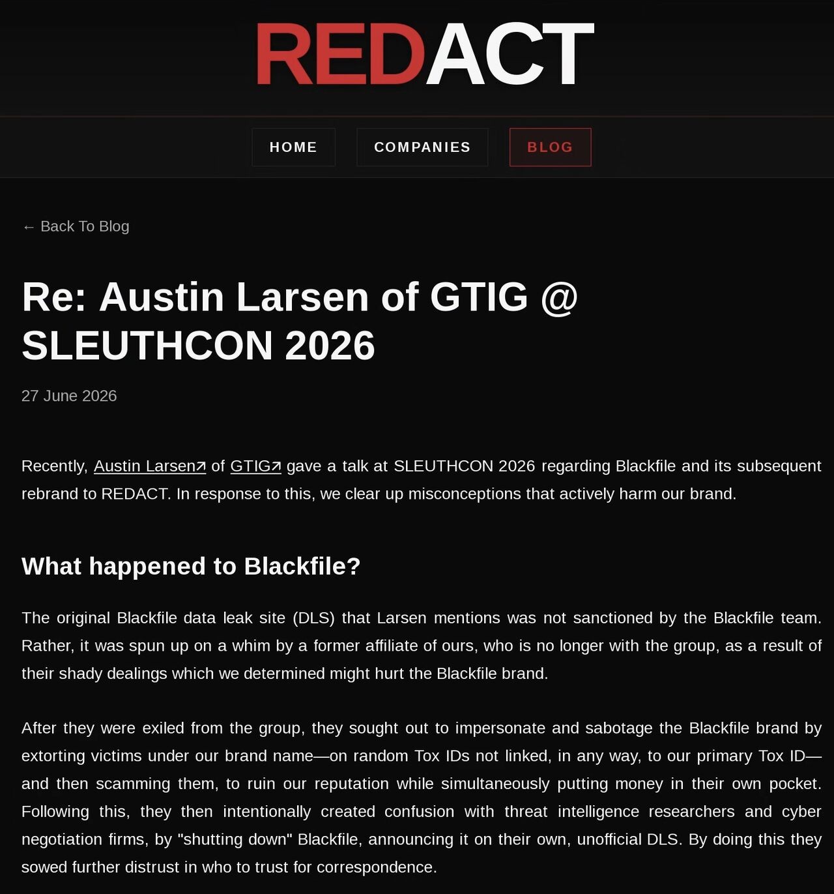

A few weeks ago, I had the opportunity to present on BlackFile's vanishing act at SLEUTHCON, alongside so many other great presentations.

During the lightning talk, I covered how this data theft extortion group we track as UNC6671 quietly became one of 2026's most impactful threats. The session specifically focused on their sudden disappearance mid-negotiation, the strange emergence of subsequent leak sites, and the operational discrepancies that made their rebrand so chaotic.

I really appreciate all the follow-up conversations and feedback from attendees. Interestingly this week, the most unique feedback came from an unexpected source. BlackFile (now operating as REDACT) provided their own thoughts on my presentation on their Data Leak Site.

They claim that the erratic behavior, the original data leak site, and the sudden shutdown I discussed were actually the work of a "rogue and exiled affiliate" trying to sabotage their brand and scam victims. They also explicitly denied observations regarding their move to new communication channels and insisted their rebrand to REDACT was simply to distance themselves from a tainted name.

Their explanation of a rogue affiliate is certainly plausible, but it leaves some multi-million-dollar questions unanswered. If this was just a simple rebrand to protect their reputation, why did they abandon all of their mid-flight ransom negotiations? Given the suspicious timing of a rival group publicly soliciting info on them just days before they vanished, you have to wonder what else was playing out behind the scenes. I'll let you review my slides and decide for yourself.

<iframe src="/files/blackfile-sleuthcon-deck.pdf" title="SLEUTHCON 2026 slide deck: BlackFile's Vanishing Act"></iframe>

- Slides: https://austinlarsen.me/files/blackfile-sleuthcon-deck.pdf
