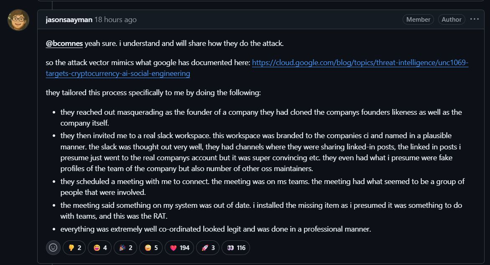
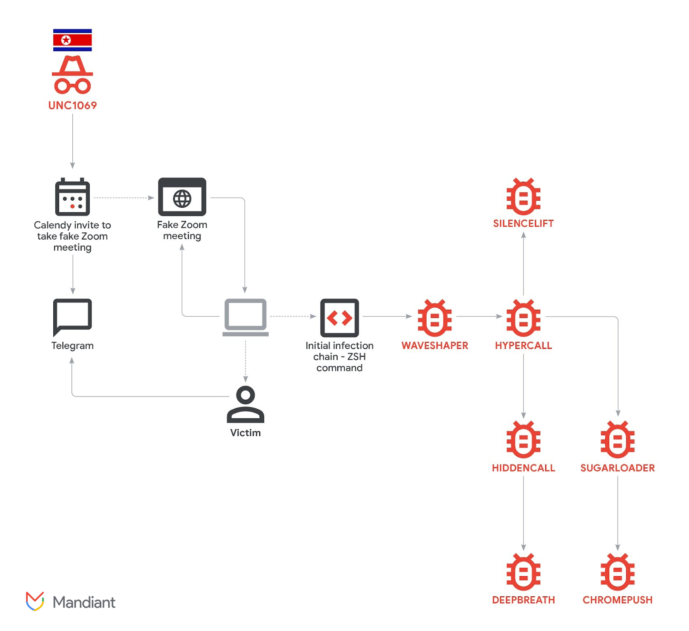

Back in February, our team at Google Threat Intelligence Group published research on #UNC1069, a financially motivated North Korean threat actor we've tracked since 2018, detailing how they had evolved their social engineering to incorporate AI-generated deepfakes, compromised accounts, and fake video calls to target cryptocurrency founders and developers. The goal was credential harvesting and financial theft, facilitated by multiple malware families including WAVESHAPER and SUGARLOADER.

Today, the maintainer of the #axios npm package published a detailed post-mortem confirming his compromise — the screenshot below shows his own account of the attack:

The tradecraft is strikingly consistent with what we documented months ago. The attackers cloned a real founder's identity, constructed a convincing Slack workspace with channels and profiles, then scheduled a Microsoft Teams call. During the call, a fake error prompt tricked the maintainer into running an "update" that deployed WAVESHAPER.V2, giving the attackers the npm credentials needed to publish trojanized versions of axios.

This is the same operational pattern: cloned or compromised identities used to build trust, meeting infrastructure to deliver the lure, and a social engineering hook disguised as a routine technical prompt. What's changed is the target selection. UNC1069 has historically focused on crypto startups, venture capital firms, and DeFi developers. Pivoting to open-source maintainers with packages pulling nearly 100 million weekly downloads represents a significant escalation in ambition.

**For defenders:** if you haven't already assessed your exposure to these recent supply chain compromises, now is the time. Rotate credentials, audit dependencies, harden publish pipelines, and adopt immutable release workflows where possible.

Full research on UNC1069's AI-enabled social engineering, malware analysis, and IOCs: [cloud.google.com/blog/topics/threat-intelligence/unc1069-targets-cryptocurrency-ai-social-engineering](https://cloud.google.com/blog/topics/threat-intelligence/unc1069-targets-cryptocurrency-ai-social-engineering)
